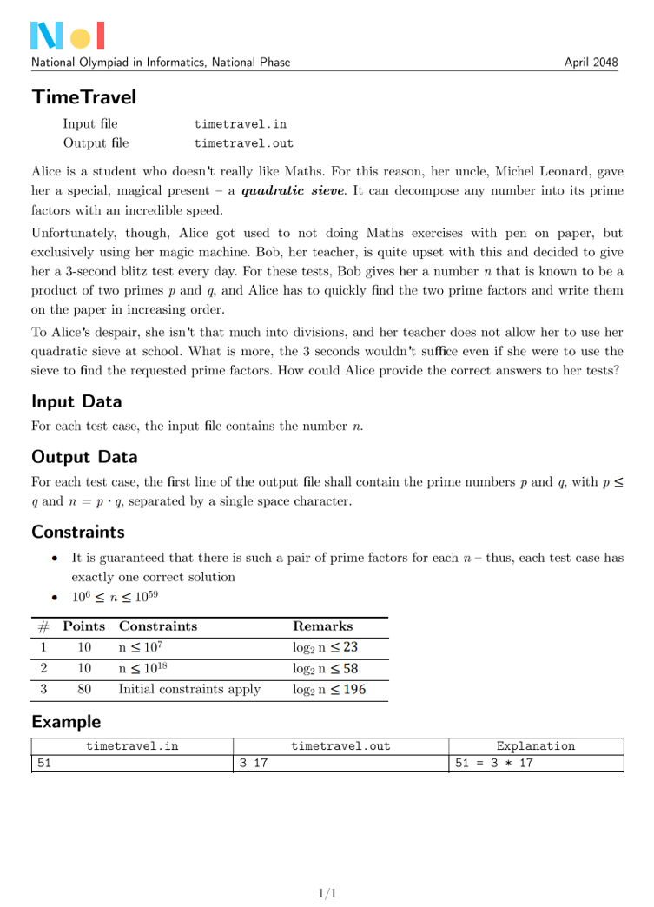
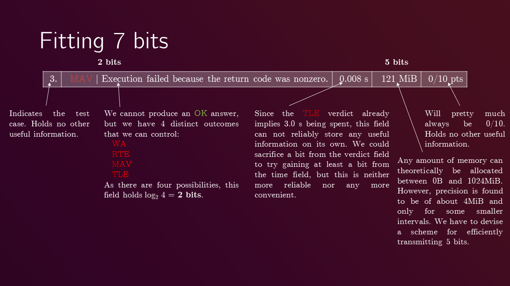
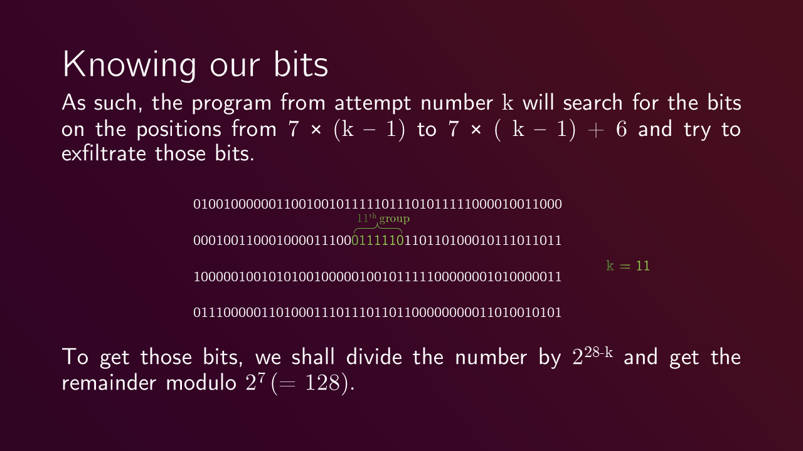
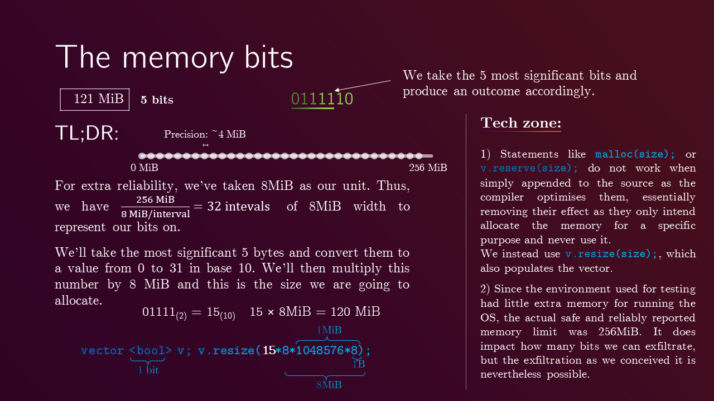
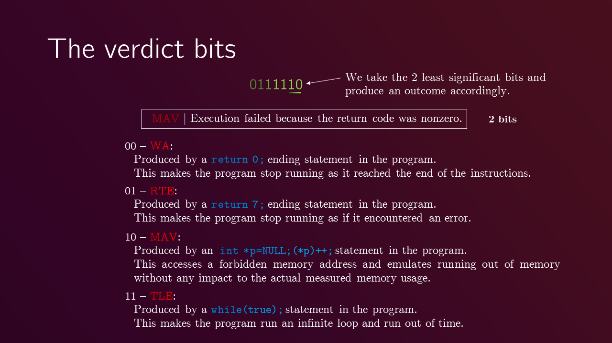
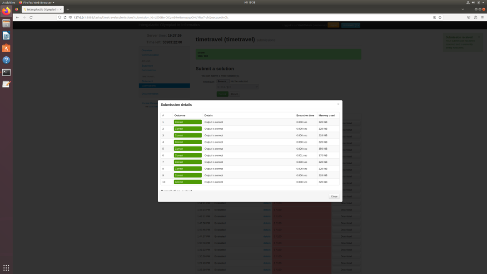
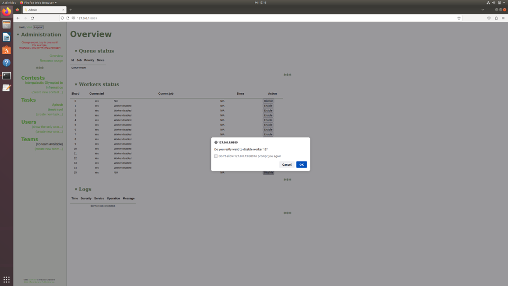
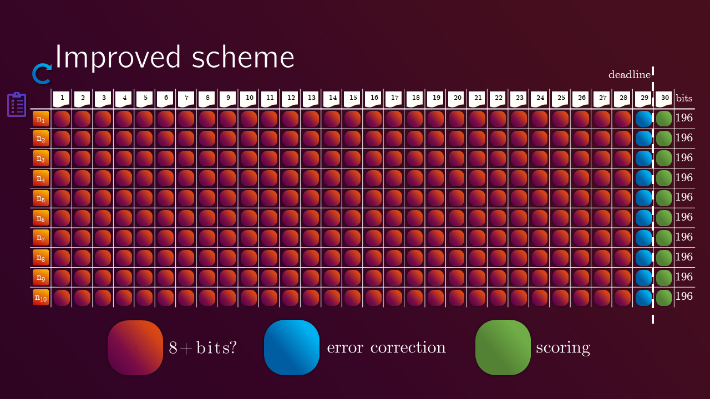

# Competitive Programming Data Exfiltration PoC

This repository contains a Proof-of-Concept (PoC) demonstrating how sensitive test data can be exfiltrated from competitive programming autograders (like CMS) using side channels.

## Overview

In competitive programming, test cases are kept secret to ensure participants write general algorithms rather than hardcoding answers. However, autograding platforms provide feedback such as **verdicts** (e.g., WA, RTE, TLE) and **resource usage** (Time, Memory). This PoC demonstrates a "data exfiltration" attack on CMS-hosted problems where a submission intentionally triggers specific verdicts and memory usage to "leak" the bits of the secret input back to the attacker.

### Attack Strategy

The attack is applicable mainly in problems where solutions are heavily compute-bound, with input sizes relatively small compared to compute needed by the program.

  

The goal, for this proof of concept, is to extract a 196-bit secret number (e.g., a large RSA-style integer to be factored). For this statement, at the time of writing this, it is known that no efficient algorithm exists to factor such numbers within the constraints specified above.

Given a limit of 30 attempts, the attack exfiltrates approximately 7 bits per submission.

  

1. **Bit Grouping**: Each submission (attempt) targets a specific 7-bit window of the secret input.

  

2. **The Memory Side-Channel (5 bits)**:
* The 5 most significant bits of the targeted window are mapped to a value between 0 and 31.
* The program allocates memory proportional to this value (e.g., in 8MiB increments).
* By reading the "Memory Used" in the grader feedback, the attacker recovers these 5 bits.

  

3. **The Verdict Side-Channel (2 bits)**:
The 2 least significant bits are mapped to four possible exit statuses:
* `00` -> **WA** (Wrong Answer): Triggered by `return 0;`.
* `01` -> **RTE** (Runtime Error): Triggered by `return 7;`.
* `10` -> **MAV** (Memory Access Violation): Triggered by a null pointer dereference.
* `11` -> **TLE** (Time Limit Exceeded): Triggered by an infinite `while(true)` loop.

  

## Implementation Details
The implementation in [`src/main.cpp`](src/main.cpp) follows these steps:

* **Input Handling**: Reads the secret input string (e.g., from `timetravel.in`).
* **Bit Extraction**: Uses a `longDivision` helper to convert the large decimal input into binary and isolate the 7-bit window for the current attempt .
* **Memory Allocation**: Calls `v.resize()` with a calculated size to ensure the memory usage is reported by the grader.
* **Verdict Triggering**: Executes the specific exit strategy to produce the desired verdict.

  

  Example of feedback received from CMS after a submission.

After all the bits are exfiltrated, they are combined to reconstruct the original secret input cases. These can be processed further as needed (e.g., factoring the large integer), locally, with no performance constraints. The outputs for the test cases are hardcoded in the submission in a `switch` statement that produces the correct result for each test case.

  

  Full points achieved after hardcoding the outputs for the extracted test cases.

## Reproducibility
> [!IMPORTANT]
> It is *very* important to run the version of Ubuntu indicated by CMS's [docs](https://cms.readthedocs.io/en/latest/Installation.html#ubuntu) (as of writing this, CMS v1.4 required Ubuntu 18.04) so that CMS can be properly installed. Otherwise, no guarantees are made about compatibility with isolate installation and/or Python's Dependency Hell.

* CMS was installed as recommended in this documentation: https://cms.readthedocs.io/en/v1.4/. For your interest, no venv was used and optional dependencies were not installed. CMS was downloaded as an archive, for Python dependencies to be installed using `pip`.

* The file `config/cms.conf.sample` was copied to `/usr/local/etc/cms.config`, the only modifications done being changing the connection string so that the current Ubuntu user and password are specified, as well as changing the default `secret_key` for a random hex string and `keep_sandbox` to `false`.

* CMS was run as described in the documentation, by first starting the Admin interface and setting up a contest. Please note that contest names **must not** contain spaces, or the contestant login process will error out!

* The feedback level was set to *full* for all tasks and the entire contest. The time limit was set to `3 seconds` and the memory limit was set to `1024MiB` (essentially, so as not to prematurely bottleneck the memory-consuming exfiltration). These limits are sensible for actual Olympiad tasks. The interval between two submissions was set to `60 seconds` to ensure reliability and the total number of submissions for every task was set to `30` (– standard IOI practice as well).
P.S. It is worth mentioning that CMS warns the admin of the risks of malicious practices when setting the feedback level to full so that participants are able to see the time and memory usage and the verdicts. This feedback level is set to full in Olympiads nevertheless.

> [!WARNING]
> When using a single machine, with the total machine memory set to `2048MiB` and the per-test-case memory to `1024MiB`, problems will arise, as there are 16 worker processes that, by default, in CMS, work in parallel to queue up test case evaluations when the contestants submit solutions. When multiple workers run on the same machine, this can not only occasionally cause crashes, but will also consistently affect the reported memory usage of each test and, thus, the exfiltration.
> By disabling all but one worker process, it will get the entire memory pie and, despite taking more physical time, serialising the evaluation will produce much more reliable results, emulating ‘professional’ configurations of CMS, spanning an entire network of single-worker machines, at the only cost of not being able to support multiple contestants at the same time as easily.

  

## Possible improvements
* **Increased Bitrate**: Explore more granular memory allocation strategies or higher domain sizes to increase bits extracted per submission.
* **Error Correction**: Implement error-correcting codes to mitigate potential inaccuracies in memory usage reporting.
* **Adaptive Strategies**: Develop adaptive submission strategies based on previous feedback to optimize bit extraction.

  

## Ethical Disclaimer
> [!NOTE]
> This PoC is for educational and security research purposes only. It highlights the importance of limiting the granularity of feedback in automated judging systems to prevent information leakage.
